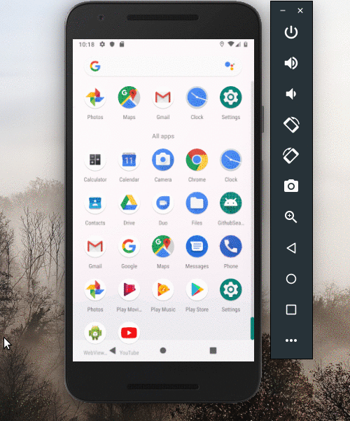

# GithubSearcher
- github api 
- Databinding
- viewModel
- retrofit2
- coroutine
- RecyclerView(MultiViewHolder)
를 간략하게 사용한 예제

### retrofit 설정  
> retfrofit2 설정방법 정리 

~~~
app의 build.gradle에서 
dependencies에서 다음추가  

    implementation 'com.squareup.retrofit2:retrofit:2.6.0'
    implementation 'com.squareup.retrofit2:converter-gson:2.3.0'
    implementation 'com.squareup.retrofit2:converter-scalars:2.3.0'
    implementation 'com.squareup.okhttp3:logging-interceptor:3.8.0'
    implementation ("org.jetbrains.kotlinx:kotlinx-coroutines-core:1.4.2")

~~~

- retrofit 초기세팅 
~~~kotlin

// 1. addInterceptor는 해더에 값을 추가하거나 덤프를 떠야할 때 사용 
// 2. addConverterFactory에서는 Gson 사용하기를 권장 
object api {
    val BASE = "https://api.github.com"
    val builder = OkHttpClient.Builder()
        .addInterceptor( HttpLoggingInterceptor().apply {

            // 3. Debug시에 모든 패킷을 덤프
            setLevel(HttpLoggingInterceptor.Level.BODY)

        } )

    val function: ApiService
        get() {
            val retrofit = Retrofit.Builder()
                .baseUrl(BASE)
                .addConverterFactory(GsonConverterFactory.create())
                .client(builder.build())
                .build()

            return retrofit.create<ApiService>(ApiService::class.java!!)
        }
}
~~~

- API 정의(URL)

~~~kotlin

// @get  -> get 방식
// @Query -> queryString value
// @post -> post 방식 
// Gson 사용하기를 하더라도 리턴값을 JSonObject로 정하고 가져올 수 있다. 
interface ApiService {
    
    // suspend 사용.
    // 코루틴에서 사용하기 위함. API호출시 리턴값으로 바로 데이터 값을 가져온다. 
    // Retrofit 2.6.0 이상에서 가능함 
    
    @GET("/users/{user}")
    suspend fun getUser(@Path("user") user: String): User

    @GET("/users/{user}/repos")
    suspend fun listRepos(@Path("user") user: String): List<Repo>

    // 리턴값으로 Call<데이터형>을 받는다. callback 형식으로 받아서 처리한다. 
    @GET("/users/{user}/repos")
    fun listReposWithPage(@Path("user") user: String, @Query("page") page : Int): Call<List<Repo>>

}

// 
/*
  1. JSON 필드명만 일치한다면 일부 필드만 가져와서 클래스에 대입시킬 수 있다.  
  2. Post로 해더와 데이터 보내기   
       @Body로 전달될 클래스명
       @Headers에 값정의 
  
  @Headers("Content-Type: application/json", "X-Requested-With: XMLHttpRequest")
  @POST("/posts")
  fun postTest(@Body params: [클래스]): Call<ResponseBody>
*/
~~~

- JSON을 Data와 매칭 

~~~kotlin

package com.psw.adsloader.githubsearcher.model

// 아래는 통신하는 JSON의 일부 필드명만 일치하는 클래스이다. 
// 응답을 받고처리할 때는 일부만 사용해도 되지만, 
// 요청을 할 경우는 필드를 정확히 일치하게 해주는 것이 
// 오류를 예방할 수 있다. 
data class User(
    var login        : String,
    var public_repos : Int,
    var public_gists : Int,
    var followers    : Int,
    var following    : Int

)

data class Repo(
    var id : String?,
    var name : String?,
    var full_name : String?,
    var stargazers_count : Int,
    var size             : Int,
    var description      : String?,
    var clone_url        : String,
    var owner :Owner?
)

data class Owner(var html_url : String)

~~~

### Databinding & Viewmodel 설정
> MVVM의 기본이 되는 LiveData, ViewModel, DataBinding을 직관적으로 이해하기 위한 소스 

~~~
app의 build.gradle에서 

plugin에서 다음추가 
apply plugin: 'kotlin-kapt'

...

dependencies에서 다음추가  

kapt "com.android.databinding:compiler:3.0.1"

dataBinding {
    enabled = true
}

~~~

DataBinding

- XML에서는 layout으로 시작하고 그 안에 data와 view를 분리한다. 

~~~xml

<?xml version="1.0" encoding="utf-8"?>
<layout xmlns:android="http://schemas.android.com/apk/res/android"
        xmlns:app="http://schemas.android.com/apk/res-auto">

    <data>
        <variable
                name="data"
                type="com.psw.adsloader.githubsearcher.view.MainActivityData" />

    </data>

    <androidx.constraintlayout.widget.ConstraintLayout
            android:layout_width="match_parent"
            android:layout_height="match_parent">

        <LinearLayout
                android:orientation="vertical"
                android:layout_width="0dp"
                android:layout_height="0dp"
                app:layout_constraintBottom_toTopOf="@id/bottom_nav"
                app:layout_constraintEnd_toEndOf="parent"
                app:layout_constraintStart_toStartOf="parent"
                app:layout_constraintTop_toTopOf="parent"
                android:id="@+id/linearLayout">
            <TextView
                    android:textSize="24sp"
                    android:textColor="#eeeeee"
                    android:background="@color/colorBackground"
                    android:id="@+id/txtTitle"
                    android:gravity="center"
                    android:text="@{data.title}"
                    android:layout_width="match_parent"
                    android:layout_height="wrap_content"/>

            <androidx.recyclerview.widget.RecyclerView
                    android:background="@color/colorBackgroundRecycler"
                    android:id="@+id/rcyMain"
                    android:layout_width="match_parent"
                    android:layout_height="match_parent">
            </androidx.recyclerview.widget.RecyclerView>
        </LinearLayout>

        <com.google.android.material.bottomnavigation.BottomNavigationView
                android:id="@+id/bottom_nav"
                android:layout_width="0dp"
                android:layout_height="wrap_content"
                android:background="@color/colorBackground"
                app:itemIconSize="20dp"
                app:itemIconTint="#FFFFFF"
                app:itemTextColor="#00FFFF"
                app:itemHorizontalTranslationEnabled="false"
                app:labelVisibilityMode="labeled"
                app:layout_constraintBottom_toBottomOf="parent"
                app:layout_constraintEnd_toEndOf="parent"
                app:layout_constraintStart_toStartOf="parent"
                app:menu="@menu/menu_nav" >

        </com.google.android.material.bottomnavigation.BottomNavigationView>

        <ProgressBar
                android:visibility="gone"
                android:id="@+id/prgLoading"
                android:layout_width="wrap_content"
                android:layout_height="wrap_content" app:layout_constraintEnd_toEndOf="parent"
                android:layout_marginEnd="8dp" app:layout_constraintStart_toStartOf="parent"
                android:layout_marginStart="8dp" android:layout_marginBottom="8dp"
                app:layout_constraintBottom_toBottomOf="@+id/bottom_nav" android:layout_marginTop="8dp"
                app:layout_constraintTop_toTopOf="@+id/linearLayout"/>

    </androidx.constraintlayout.widget.ConstraintLayout>
    
</layout>

~~~

빌드가 안될 시

1. File  -> Invalidate Caches / Restart
2. Build -> Clean Project
3. Build -> Rebuild Project
4. Run & Debug시에 빌드가 안되면 File -> Settings에서 Instant Run을 비활성화

ViewModel 추가 

~~~
implementation "android.arch.lifecycle:extensions:1.1.1"
annotationProcessor "android.arch.lifecycle:compiler:1.0.0"
~~~